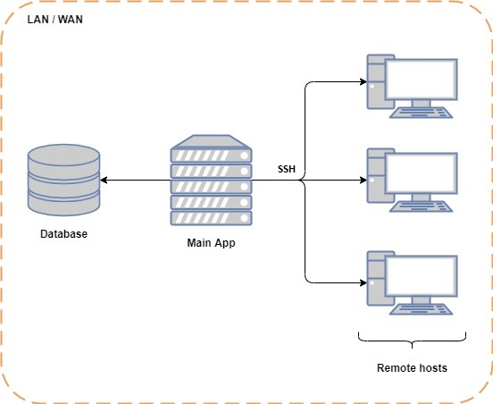

## WEB Remote Terminal

This is *Remote Terminal* web app designed to execute bash commands on remote Ubuntu hosts. The main architecture is:



### Launch instructions

App is compatible both with Windows and Linux devices. Before running the program perform the following:

- make sure you have `python3` preinstalled

- install all necessary requirements by running:

    ```
    pip install -r requirements.txt
    ```

- Run <a href="Files/DB_Postgres.sql">DB_Postgres.sql</a> script on your database instance

- Write your database credentials to the <a href="Files/settings.ini">settings.ini</a> file 

On Linux:

- install `sshpass` utility:

  ```
  sudo apt-get -y install sshpass
  ```

On Windows:

- make sure that *ssh-agent* service is running by executing:
  
  ```
    Get-Service ssh-agent | Set-Service -StartupType Manual
    Start-Service ssh-agent
    Get-Service ssh-agent
  ```
  
Finally, you just have to run `main.py` file.
### Request examples:
- Method path -> /connect
- Request Type -> POST
```
{
    "host": "10.0.0.45",
    "port": 22
    "login": "my",
    "password": "1",
    "username": "alex",
    "UseSSHKey": false,
    "rootPassword": "root",
    "command": "ls"
}
```
Connection is possible using a password or an SSH key. If the user wants to connect to the computer using a password, 
then he may not pass the UseSSHKey parameter. In order to use SSH keys, you need to pass the UseSSHKey: true parameter, 
if the key has not been previously saved by the program, then you need to pass the password from the user account (after
generating the key, you can not send the password). The rootPassword parameter should only be passed when the user wants
to run commands as an administrator (sudo).
- Method path -> /gethistory
- Request Type -> GET
```
{
    "userGUID": "c245c511-c076-4ee2-8df0-aa804ad5cc95"
}
```
The method will return the history of commands that the user has executed on computers that belong to him.
- Method path -> /savemachine
- Request Type -> POST
```
{
    "userGUID": "c245c511-c076-4ee2-8df0-aa804ad5cc95",
    "host": "10.0.0.45",
    "port": 22,
    "password": "1",
    "username": "alex"
}
```
The method saves data for connecting to a computer for a specific user
- Method path -> /saveuser
- Request Type -> POST
```
{
    "login": "my",
    "password": "1",
    "name": "alex"
}
```
The method saves the user in the system.
- Method path -> /updateuser
- Request Type -> POST
```
{
    "userGUID": "c245c511-c076-4ee2-8df0-aa804ad5cc95",
    "login": "my",
    "password": "1",
    "name": "alex"
}
```
The method allows you to update user data. In the request, you can only submit the data that you want to change. 
userGUID is a required parameter and cannot be changed.
- Method path -> /updatemachine
- Request Type -> POST
```
{
    "machineGUID": "c245c511-c076-4ee2-8df0-aa804ad5cc95",
    "host": "10.0.0.45",
    "port": 22,
    "password": "1",
}
```
The method allows you to update information about the computer. In the request, you can only submit the data that you 
want to change. machineGUID is a required parameter and cannot be changed.
- Method path -> /deleteuser
- Request Type -> POST
```
{
    "userGUID": "c245c511-c076-4ee2-8df0-aa804ad5cc95"
}
```
The method allows you to remove a user from the system.
- Method path -> /deletemachine
- Request Type -> POST
```
{
    "machineGUID": "c245c511-c076-4ee2-8df0-aa804ad5cc95"
}
```
The method allows you to remove the user's computer from the system.
### How to use the app
To use the provided controllers, you need to log in using the /login controller. Then you can use any controllers in the
system. Authorization is not needed only for /saveuser. To end a session, use /logout.