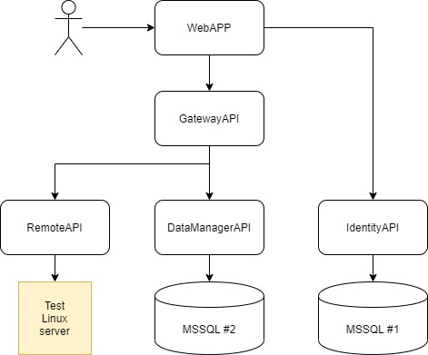

## WEB Remote Terminal

This is *Remote Terminal* web app designed to execute bash commands on remote Ubuntu hosts.

### Launch instructions

- install git-crypt and set up it
- install docker and docker-compose on your host machine
- run:

```
docker-compose -f docker-compose-encrypted.yml up -d
```

- RemoteApi - http://localhost:1414
- IdentityApi - http://localhost:1415/swagger/index.html
- DataManagerApi - http://localhost:1416/swagger/index.html
- GatewayAPI - http://localhost:1417/swagger/index.html
- WebAPP - http://localhost:1418

### Architecture

